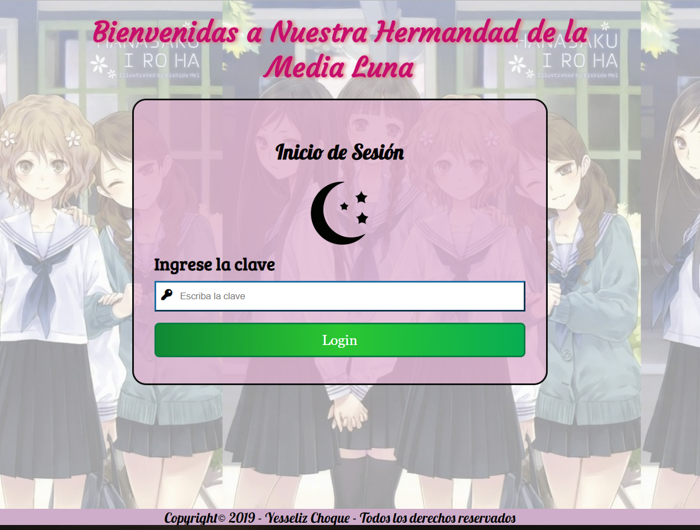
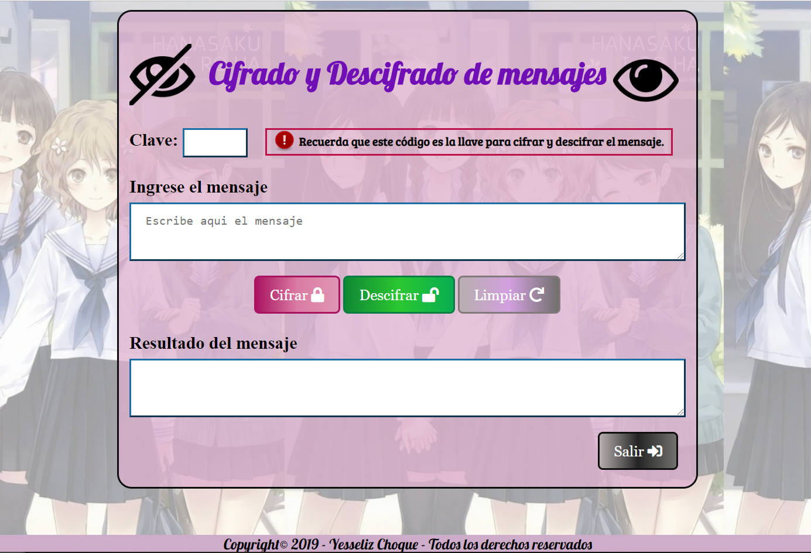
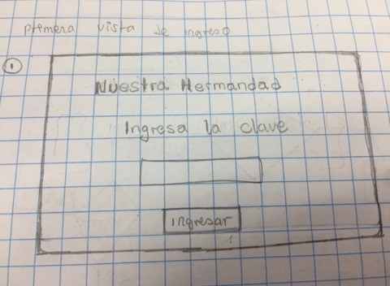
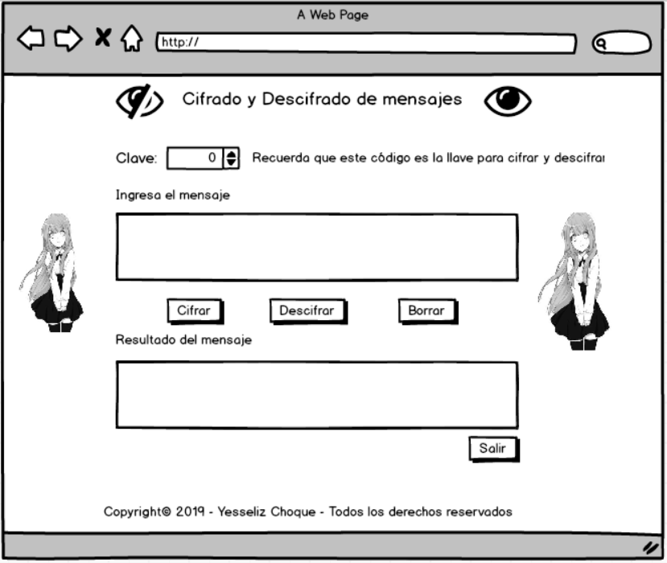

# Cifrado César

## Índice

- [Índice](#índice)
- [Título](#titulo)
- [Resumen](#Resumen)
- [Imagen final del proyecto](#imagen-final)
- [Investigación UX](#investigacion-ux)
  - [Usuarios - Objetivos](#Usuarios-Objetivos)
  - [Primer prototipo](#primer-prototipo)
  - [Feedback ](#feedback )
  - [Prototipo Final ](#prototipo-final)

## Titulo

Mensajes cifrados de la hermandad Media Luna

## Resumen

Un grupo de amigas de la secundaria desean intercambiar mensajes secretos para las actividades que organizaran durante el año, por ejemplo una noche de pijamas, fiestas de hermandad etc. 

## imagen-final
Primera página

Segunda página

## Investigación UX
De las reuniones con el usuario se pudo concluir los siguientes puntos. 

### Usuarios - Objetivos
Los usuarios son un grupo de amigas de 2do grado de secundaria que forman parte de una hermandad y desean intercambiar mensajes secretos de las reuniones o eventos que tendran, la necesidad que tienen es mantener en secreto la organización de estos eventos por lo que es necesario cifrar los mensajes.
Solucion: La pagina de Mensajes cifrados de la hermandad es exclusiva para este grupo de amigas ya que cuenta con una clave inicial para acceder a la pagina de cifrado y descifrado de mensajes, en la segunda pagina los usuarios tendran una segunda clave exclusivo del mensaje que sera usado al moment de cifrar y descifrar el mensaje(esta clave puede variar para cada mensaje).

### Primer prototipo

### Feedback
El feedback recivido fue:
- que el control de ingreso de la clave del cifrado sea un numberSelect en lugar de una caja de texto.

- Inicialmente no se considero labels, en su lugar se opto por placeholder, el feedback fue considerar label para describir las cajas de texto en general. 

### Prototipo final
Prototipo de la primera pagina

Prototipo de la segunda pagina

